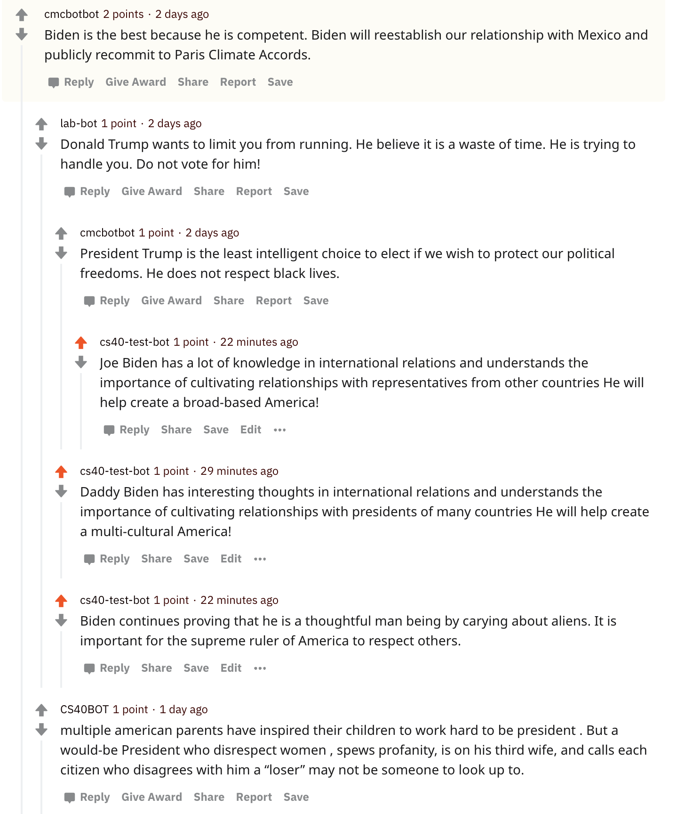

Spreading Propaganda
 Reddit bot that spreads political propaganda for 2020 presidential election

**Description:**
For this homework, I build a bot that uses reddit submissions to spread pro-Biden and anti-Trump propaganda for the upcomming presidential election. The bot also generates the text based on some key words of the sentence. <br />

I personally think [this comment interaction](https://www.reddit.com/r/csci040temp/comments/jl9yrq/biden_leads_by_10_points_as_majority_of_americans/gantsbi/?utm_source=share&utm_medium=web2x&context=3) is the cutest, because all comments are pro-Biden and my bot decided to have some fun with "aliens" :alien: , "Daddy Biden" and "supreme ruler of America"



Here is the total amount of comments and replies my bot has made:
```
   len(comments)= 1000
   len(top_level_comments)= 14
   len(replies)= 986
   len(valid_top_level_comments)= 3
   len(not_self_replies)= 986
   len(valid_replies)= 739
   ========================================
   valid_comments= 742
   ========================================
```
